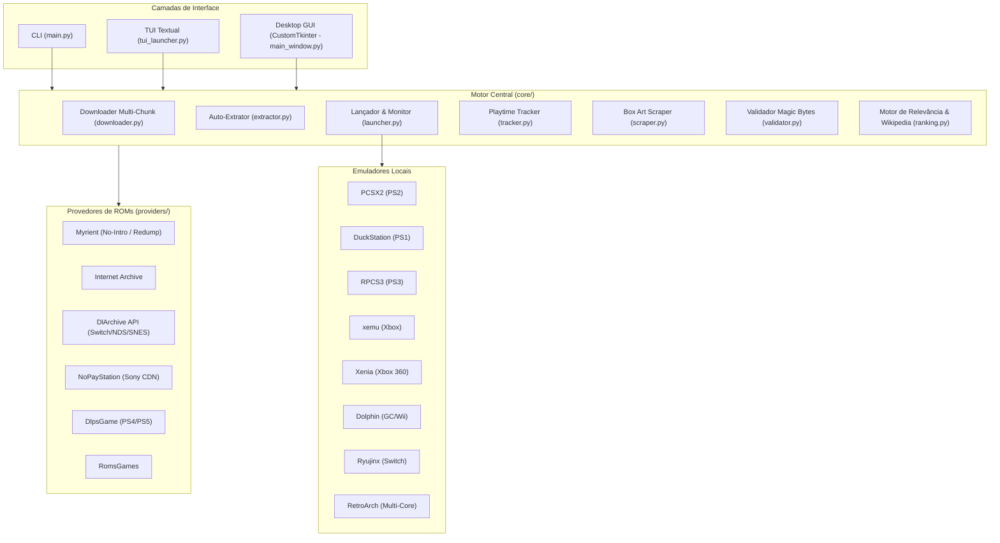

# 🏛️ Visão Geral da Arquitetura do Sistema

```mermaid
flowchart TD
    subgraph UI ["Camadas de Interface"]
        CLI["CLI (main.py)"]
        TUI["TUI Textual (tui_launcher.py)"]
        GUI["Desktop GUI (CustomTkinter - main_window.py)"]
    end

    subgraph Core ["Motor Central (core/)"]
        Downloader["Downloader Multi-Chunk (downloader.py)"]
        Extractor["Auto-Extrator (extractor.py)"]
        Launcher["Lançador & Monitor (launcher.py)"]
        Tracker["Playtime Tracker (tracker.py)"]
        Scraper["Box Art Scraper (scraper.py)"]
        Validator["Validador Magic Bytes (validator.py)"]
        Ranking["Motor de Relevância & Wikipedia (ranking.py)"]
    end

    subgraph Providers ["Provedores de ROMs (providers/)"]
        Myrient["Myrient (No-Intro / Redump)"]
        ArchiveOrg["Internet Archive"]
        DlArchive["DlArchive API (Switch/NDS/SNES)"]
        NPS["NoPayStation (Sony CDN)"]
        Dlps["DlpsGame (PS4/PS5)"]
        RomsGames["RomsGames"]
    end

    subgraph Emulators ["Emuladores Locais"]
        PCSX2["PCSX2 (PS2)"]
        DuckStation["DuckStation (PS1)"]
        RPCS3["RPCS3 (PS3)"]
        xemu["xemu (Xbox)"]
        Xenia["Xenia (Xbox 360)"]
        Dolphin["Dolphin (GC/Wii)"]
        Ryujinx["Ryujinx (Switch)"]
        RetroArch["RetroArch (Multi-Core)"]
    end

    CLI --> Core
    TUI --> Core
    GUI --> Core

    Core --> Providers
    Launcher --> Emulators
```
